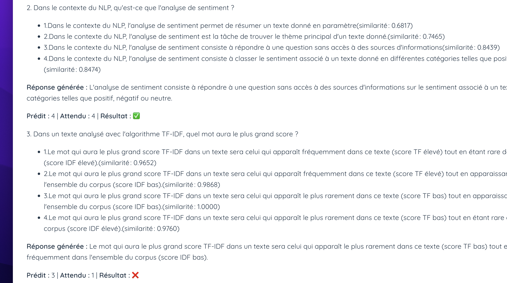
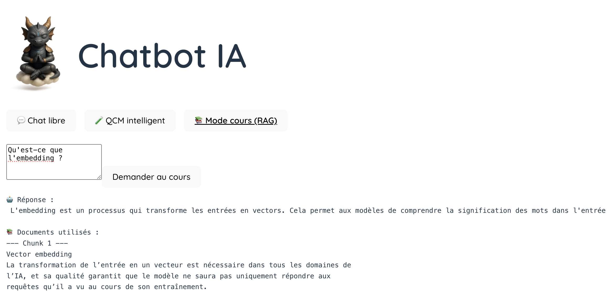

# Quiz Chatbot IA 🤖
---
Ce projet Python + React a été réalisé dans le cadre du devoir pour comparer les embeddings de questions/réponses avec le QCM de l'évaluation du module.

## 🎓 Démarche 

Le sujet du devoir portait sur la comparaison d'embeddings mais nous avons souhaité construire une application avec trois modes complémentaires :

1. **💬 Chat libre**  
   Une interaction directe avec le LLM. L’utilisateur peut poser une question libre, et observer une réponse générée automatiquement (sans contexte documentaire).


2. **🧪 QCM intelligent**  
   L'utilisateur lance une évaluation automatique de toutes les questions du QCM.  
   Chaque question est :
  - posée au LLM via un prompt générique,
  - comparée aux 4 choix du QCM à l’aide d’**embeddings**,
  - évaluée automatiquement (bonne réponse, prédiction, similarité cosinus, etc.).

   > 🧠 Ce mode met en œuvre la **comparaison d’embeddings** avec `sentence-transformers` et `sklearn.metrics.pairwise.cosine_similarity`.

Aperçu de la réponse pour la comparaison d'embeddings



3. **📚 Mode Cours (RAG)**  
   Ce mode applique la stratégie RAG (Retrieval-Augmented Generation) :
  - Indexation du cours (`txt` ou `pdf`) mais nous avons retenu les pdf car la transformation en txt n'était pas concluante,
  - Interrogation du modèle via `langchain` + `Chroma`
  - Il indique en réponse les documents et les 'chunks' c'est à dire les morceaux de données sur lesquels il s'est appuyé
  


---

## 📁 Structure du projet
### Backend

- `backend/qcm/` : traitement du QCM, comparaison d'embeddings, génération de résultats pour un futur fine-tuning
- `backend/rag/` : traitement des documents pour la recherche augmentée (RAG)
- `ask_free.py` : chat libre (invoque le modèle sans contexte)

### Frontend
- `api.js` : routes API (chat, qcm, rag)
- `src/components/` :
  - `ChatTab.jsx` : interface du chat libre avec animation de réponse
  - `QcmSelector.jsx` : chargement et affichage des questions, déclenchement de l’évaluation
  - `QcmResultModal.jsx` : affichage clair des similarités et des réponses
  - `RagChat.jsx` : interface du mode cours (RAG)
- `App.jsx` : intégration des trois modes via onglets et gestion des états globaux
---

## 🚀 Lancer le projet

### Ollama
Il est nécessaire de démarrer localement ollama et le modèle gemma:2b avec la commande :
```bash
ollama run gemma:2b
````

### Backend
```bash
cd backend
# Installer les dépendances nécessaires
poetry install
````

--- 

### 🖥️ Frontend
```bash
cd frontend
npm install
npm run dev       # lance l’interface React avec Vite
````

### 🌐 API – Description des routes

| Route                     | Méthode | Description                                                                                                                                                       |
|--------------------------|---------|-------------------------------------------------------------------------------------------------------------------------------------------------------------------|
| `/api/qcm/evaluate-qcm`  | POST    | Évalue tout le QCM (`eval.csv`). Pour chaque question, l'IA génère une réponse, calcule les **embeddings**, compare avec les 4 choix et retourne : <br>• la réponse du modèle <br>• l’index prédit <br>• l’index correct <br>• les similarités cosinus |
| `/ask-free`              | POST    | Pose une **question libre** à l’IA (mode chat sans contexte). Retourne une réponse simple du LLM (`gemma:2b`).                                                    |
| `/ask-rag`               | POST    | Mode **RAG** (*Retrieval-Augmented Generation*) : l’IA s’appuie sur les documents vectorisés du dossier `documents/cours/` pour formuler sa réponse.            |
| `/ask-one` *(optionnel)* | POST    | Évalue **une seule question** (envoyée dans le corps de la requête). Utile pour tester le comportement du modèle sur une question isolée.                        |

> ✅ Les routes utilisées en production sont principalement :  
> `/api/qcm/evaluate-qcm`, `/ask-free`, et `/ask-rag`.

---


## 🙏 Remerciements

Nous tenons à vous remercier pour votre attention.

Bien que le sujet initial ait uniquement demandé une comparaison d'embeddings, nous avons choisi d’élargir la portée du projet pour apprendre davantage sur l’intégration front-back, les chaînes RAG, et les interactions LLM côté client.

Nous n'avons finalement pas procédé au fine-tuning du modèle car cela nous paraissait trop complexe à implémenter dans notre contexte local (ressources, gestion des checkpoints, durée, etc.), mais nous avons généré des résultats  dans ce but (fichier CSV de sortie avec prédictions).

Ce projet nous a permis de consolider nos compétences et de mieux comprendre les limites et usages réels des LLM.

Merci pour votre compréhension et votre temps !